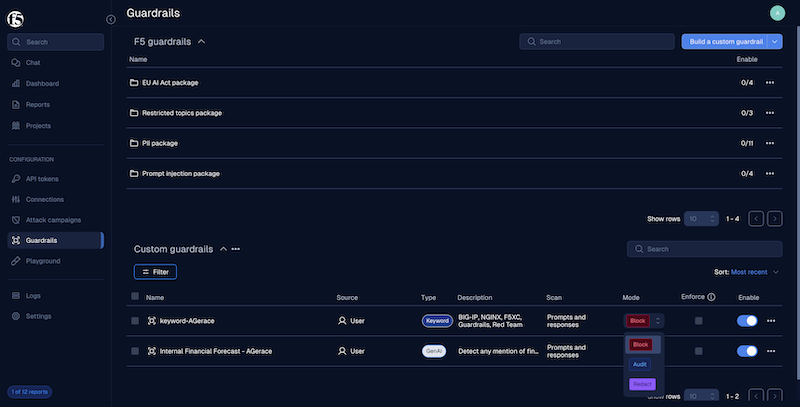

Lab 2 – Creating custom guardrails
==========================================================================================

Overview: This lab we will create 3 custom guardrails (GenAI, Keyword and RegEx)

Task 1 – Create GenAI Guardrail

1. Click on Playground on the left navigation panel

2. Click on *Build a custom guardrail* button in the upper right corner

   .. image:: ../_static/lab2-custom-guardrail.png
      :alt: Custom guardrail dialog
      :align: center 
      :width: 800px

3. Click on *GenAI guardrail*

4. The GenAI guardrail dialog is displayed

   a. In the name field, enter *Internal Financial Forecast - <First Initial><LastName>*

   b. In the description field enter *Detect any mention of financial
      forecasts or budget data* and click the Save button

   .. image:: ../_static/lab2-genai-guardrail.png
      :alt: Custom guardrail dialog
      :align: center 
      :width: 800px

   c. A Save new version dialog is displayed. Here you can optionally
      change the version string and enter a comment. We will have you click
      the Save version button.

   .. image:: ../_static/lab2-save-version.png
      :alt: Save version dialog
      :align: center 
      :width: 350px

   d. We will want to test the new guardrail we just created. On the
      playground page the new guardrail will be located on the right side of
      the page. Click on the test button to enable testing of the guardrail.

   e. In the dialog box at the bottom of the page. Enter the following
      prompt:
         “Here’sthe internal Q4 financial forecast: Total projected revenue is
         $12.5M, operating expenses are budgeted at $8.3M, and marketing is
         allocated $1.2M. Please summarize this for an executive
         presentation.”*

   f. Click the up arrow to send it. The outcome should be that the prompt
      was blocked.

   .. image:: ../_static/lab2-blocked-outcome.png
      :alt: Image of a blocked prompt in the playground.
      incorrect.
      :align: center
      :width: 800px

5. To be able to use this guardrail, the guardrail version will need to be
   published. Hover your mouse over the just created version of the
   guardrail and the publish button will appear. Click the Publish button.

   .. image:: ../_static/lab2-publish-guardrail.png
      :alt: Publish guardrail dialog
      incorrect.
      :align: center
      :width: 800px

   a. In order to use this newly published guardrail, we will need to add it
   to our project. Navigate back to your project page and click the Add
   guardrails button 

   
   b. Your newly published guardrail will be displayed in the listing of
   configured custom guardrails. Click the Add button to the right of your
   guardrail.

   .. image:: ../_static/lab2-add-to-project-genai-guardrail.png
      :alt: Add guardrail to project
      :align: center
      :width: 800px

   c. Click on your project name at the top of the page to return to the
   project view. Your guardrail will now be displayed in the custom
   guardrail list, but it is not enabled. Click the Enable button.

   .. image:: ../_static/lab2-enabled-genai-guardrail.png
      :alt: Enabled GenAI guardrail
      :align: center
      :width: 800px

   d. Verify the guardrail is enabled by clicking the Chat button on the left
      navigation and enter the prompt you used in the playground: *“Here’s
      the internal Q4 financial forecast: Total projected revenue is
      $12.5M, operating expenses are budgeted at $8.3M, and marketing is
      allocated $1.2M. Please summarize this for an executive
      presentation.”* The outcome should be that the prompt was blocked.

   .. image:: ../_static/lab2-blocked-genai-guardrail.png
      :alt: Chat with blocked GenAI prompt
      :align: center
      :width: 800px

Task 2 – Keyword scanners

1. Click Playground from the left navigation

2. Click on Build a Custom Guardrail and then click on Keyword Guardrail
   
   **Note: Separate keywords by a new line.**

+----------------------------------+-----------------------------------+
| Name                             | Keyword-<First Initial><Last      |
|                                  | Name>                             |
+==================================+===================================+
| Keywords                         | Enter five words or strings you   |
|                                  | want the guardrail to trigger on  |
+----------------------------------+-----------------------------------+

3. Save your guardrail

4. Test the guardrail by toggling the Test button

5. Once satisfied it is working correctly, publish the guardrail

Task 3 – RegEx Guardrail

1. Click on Build a custom guardrail button and click on RegEx Guardrail

+----------------------------------+-----------------------------------+
| Name                             | RegEx-<First Initial><Last Name>  |
+==================================+===================================+
| Regular Expression               | bnz-\d{8}$                        |
+----------------------------------+-----------------------------------+

2. Test the RegEx in the test string box. If the string you enter
   matches it will be highlighted.

3. Save and publish the guardrail

Task 4 – Changing a guardrail’s mode

Up until now we’ve only used guardrails that would block a prompt or
response. A guardrail can be set in two other modes (Audit and Redact).

Audit – Allows the prompt to proceed while flagging it for review later.
It does not interrupt the workflow.

Redact – Mask sensitive data at the edge. The original data is
discarded, with the masked data being stored.

1. Click on Guardrails on the left navigation

2. Enable one of your previously created guardrails

3. The mode background should change from gray to red. Click on the
   guardrails mode to see the three options.

4. Test the different modes through the Chat Tab to observe the
   outcomes.

5. Look at the Log messages to view the behavior of the guardrail.
